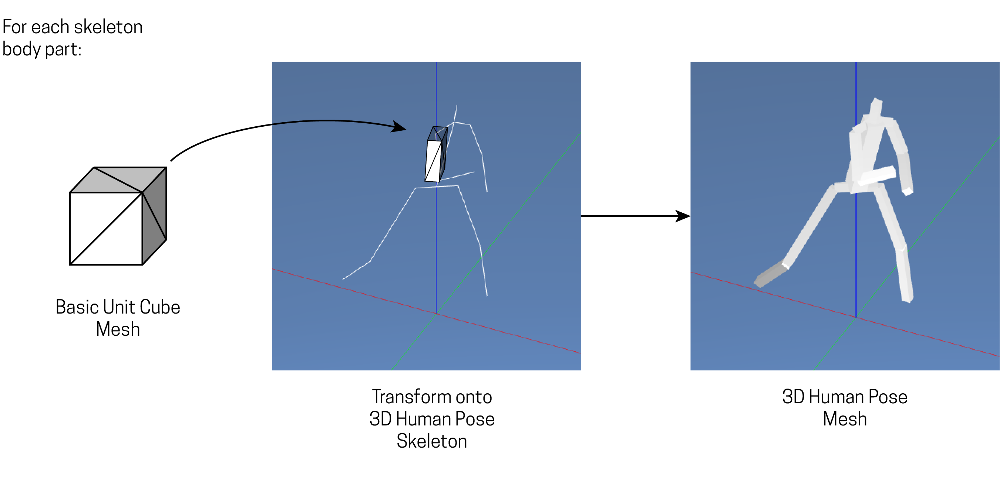

# 3D Human Pose Estimates Visualized with Generated Meshes

Using C++ and OpenGL, this program allows for the 3D pose estimation results to be viewed...well in 3D! From any angle! Compared to the default plots from the original deep learning algorithm, viewing the 3D poses from any perspective enables us to more fully evaluate the estimation vs reality.

An example of results visualizations can be found [here](https://vimeo.com/380161358).

## Demo / Getting Started

### CMake

If this is the first time you cloned or downloaded this repository, you'll need to set up with CMake (so install CMake before continuing).

Then, with `Pose_3DView` as the current directory in terminal:

```
mkdir build
cd build
cmake ../
```

While in the `build` directory in terminal, compile the code:
```
make
./Pose_3DView_bin
```

### OK it's running...

Once the build is running, you should see a window titled "Wushu!"

Press the '1' key to load the pose data. Specifically `data/vertices.csv` contains the vertex coordinates for all poses detected in a video sequence that follows the [Human3.6M](http://vision.imar.ro/human3.6m/description.php) dataset conventions. To visualize other human poses, you'll need to replace the csv file with your own following the same conventions for pose joints.

Once you press the '1' key, the console should display:
```
Pose coordinates loaded
All 65 keyframe poses loaded
```
The human pose mesh should also appear in the window.

Press the '/' key to begin the animation.

### Camera Control

As the animation is running (or even before you start the animation), you can adjust the camera as follows:

 - 'o' / 'p' keys switch between orthographic and perspective
 - 'a' / 'd' moves the camera on the x-axis directions
 - 'q' / 'z' moves the camera on the y-axis directions
 - 'w' / 's' moves the camera on the z-axis directions

Currently the camera gaze direction always points towards the world origin.

## How the Code Works

The current version of the code generates meshes around the 3D pose skeletons in `data/vertices.csv` using the unit cube mesh (`data/cube.off`).



Meshes are then visualized in OpenGL. Future development of the code will look at fancier means of generating meshes around the 3D pose skeletons like MD5 and FBX files.

As detailed in the README for this overall project, you can generate your own `vertices.csv` file to visualize 3D human pose estimates.
