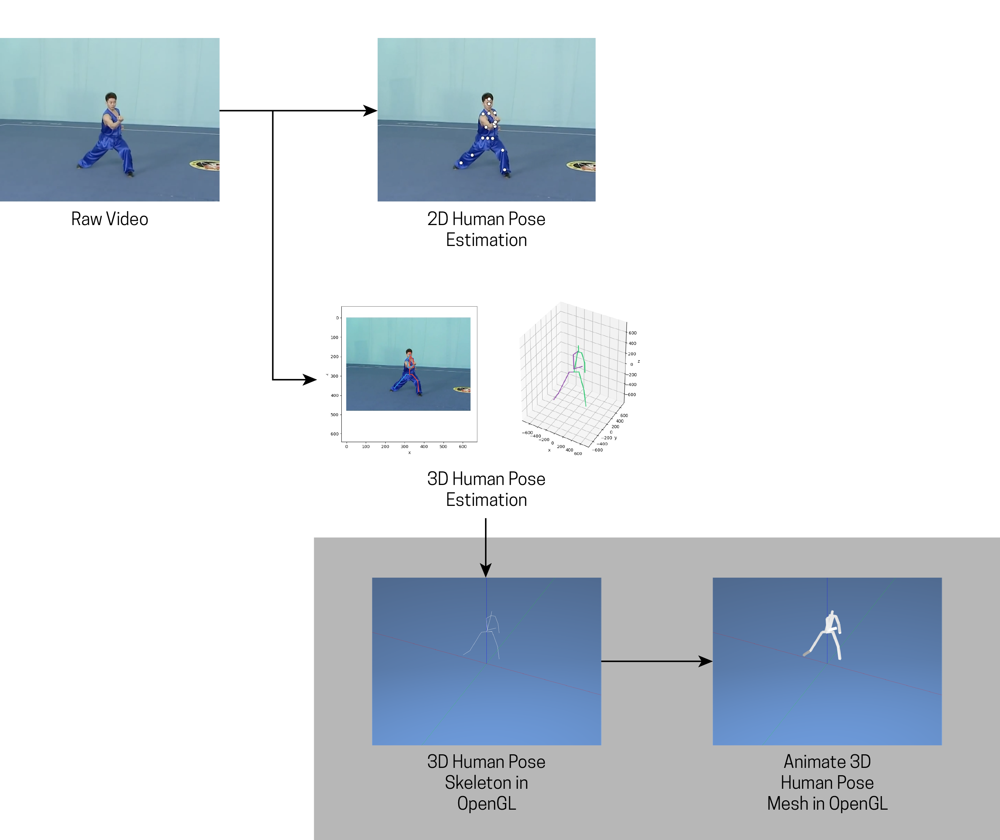
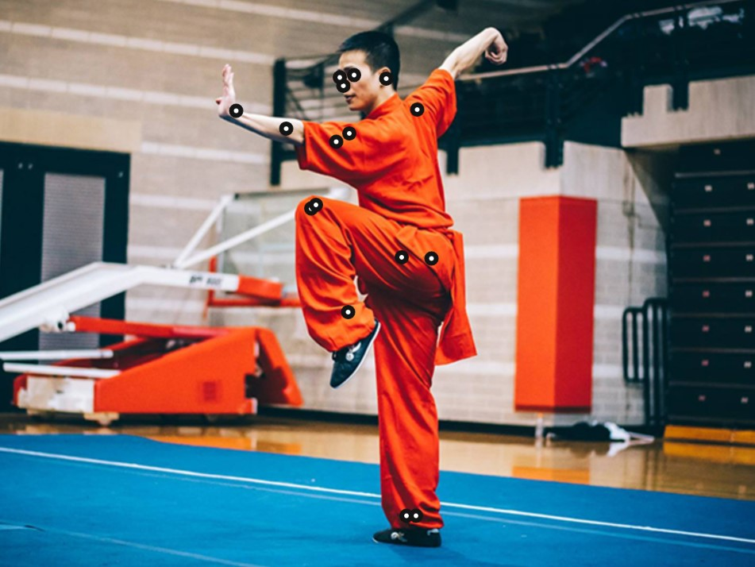

# nomocap

 *"motion capture" in the wild*

The primary purpose of this code is to use 3D human pose estimation deep learning models and 2D direct linear transformation to generate a 3D representation of a wushu performance on a standard wushu competition carpet. Essentially, doing what motion capture systems do with suites of cameras, sensors, and suits...but with only a single video. Hence the project name, "nomocap" = No More Motion Capture!

Currently based on rayat137's [Pose_3D](https://github.com/rayat137/Pose_3D) code (see References for details on changes). Of course, a number of other 3D human pose estimation methods/scripts are [out there](https://paperswithcode.com/task/3d-human-pose-estimation).

Diagram of the current pipeline:



## Getting Started

### Dependencies

First it's recommended to use Anaconda or some other virtual environment.

```
conda create --name nomocap python=3.7 numpy matplotlib cython
```

Once the virtual environment is activated, use pip to install the requirements.txt file:
```
pip install -r requirements.txt
```

Note the versions of tensorflow, opencv-python, and opencv-contrib-python. The version numbers for those are **critical**.

### Training Data and Model

Two folders containing the training data and pre-trained model are excluded from this public repository, due to the large size of their files:
```
Pose_3D/h36m/
Pose_3D/trained_model/
```
These two folders need to be created and filled with the following data:

The `h36m` folder contains the Human3.6 baseline 3D pose data, which can be downloaded with wget:
```
wget https://www.dropbox.com/s/e35qv3n6zlkouki/h36m.zip
```
(wget can be installed for Windows through this link: https://sourceforge.net/projects/gnuwin32/files/wget/1.11.4-1/wget-1.11.4-1-setup.exe/download?use_mirror=excellmedia. Once installed, add `C:\Program Files (x86)\GnuWin32\bin` to your PATH environment variable.)

Chances are, after downloading with wget, you will have a file literally named `file`. Rename it to `h36m.zip` and unzip to a new `h36m` folder inside Pose_3D directory.

The `trained_model` folder contains the trained model

 0. Create the trained_model folder within Pose_3D directory
 1. Download the tar file: https://drive.google.com/file/d/1j2jpwDpfj5NNx8n1DVqCIAESNTDZ2BDf/view?usp=sharing
 2. Untar the archive and move the files to here: `Pose_3D/trained_model/All/dropout_0.5/epochs_100/adam/lr_1e-05/linear_size1024/batch_size_32/use_stacked_hourglass/seqlen_5`


### OK Now We're Ready!

Now that you have everything installed and downloaded, you need to do the following to get 3D pose estimates:

1. Get 2D pose estimate data from raw video saved as a `*.h5` file. This can be done with code in the `Pose_2D` folder. More on this in the next section.
2. Get image frames of the video as jpg files. This can be done using Premiere to export the raw video as jpg files for frames at the same framerate as your 2D pose estimate data (likely ~30fps). Other methods may be available online if you don't have Premiere.
3. Save files from both steps 1 and 2 into `Pose_3D/input_files`
4. In terminal, set current directory as `Pose_3D` run the `create_movie.py` script (`python create_movie.py`). If you are using a virtual environment, of course, make sure it's activated.
5. Results will be in `Pose_3D/output_results`, including a sequence of images showing the 3D pose results and a csv file of X,Y,Z coordinates of pose joint estimates (`vertices.csv`).
6. The `vertices.csv` can be used to generate 3D animations of the 3D pose estimate. A example code of how to do this with OpenGL is in the `Pose_3DView` folder.

### Pose_2D - Getting 2D Pose Estimates

Hossain and Little used a stacked-hourglass detector to get 2D pose estimates prior to running their 3D pose estimation script. In their code example, these 2D estimates are saved to an h5 file (`Pose_3D/fed/preds.h5`).

I was more familiar with using PoseNet for 2D pose estimates, so I wrote some Javascript to record PoseNet estimates in the sequence per Human3.6M dataset standard (see the `Pose_2D/static/` folder).

For reference, below is a "conversion chart" for Human3.6M's and PoseNet's pose joint indices.


(Human3.6M tracks more joints/body parts shown above. A quick reference for joint numbers can be found in `Pose_3D/data_util.py` )

**Using PoseNet**

If you have no experience with 2D pose estimation, a good place to start is the `Pose_2D` folder.

 1. Use the images extracted from the video and save them to the `Pose_2D/static/image_set/` folder. Note the total number of images you extracted and their file name convention.
 2. Open the script `Pose_2D/static/sketch_imageset.js`. Two very important lines of code need to be edited depending on your images and their filenames:
 ```
 let numImages = 95; //number of images extracted from video
 let imageName = 'wangdi'; //image name repeated across all video images
 let imgWidth = 500;
 let imgHeight = 480;
 //example: image files extracted 'wangdi.mp4' video are all named 'wangdi00.jpg', 'changquan2s01.jpg',...,etc.
 //imageName = 'changquan2s'; in that case
 //if you have over 100 or 1000 images in sequence other parts of the code (imgNumStr = `0${imgNum}`;) need to be modified
 ```
 3. With `Pose_2D` set as the current directory in terminal, type `flask run` to run a local server. You should see something like:
  ```
  * Environment: production
    WARNING: This is a development server. Do not use it in a production deployment.
    Use a production WSGI server instead.
  * Debug mode: off
  * Running on http://127.0.0.1:5000/ (Press CTRL+C to quit)
  ```
 4. Go to the `http://127.0.0.1:5000/` in a browser (or whichever address is in the terminal output above).
 5. The images will automatically be loaded one by one, with PoseNet estimating 2D key joint positions for each. Text on the top of the webpage will inform when all the images are processed.
 6. Click anywhere on the webpage to save the `arrays.csv` file to the `Pose_3D/input_files/` folder. Inside that folder there should already be a script, `h5converter.py`, to take the csv file and generate the h5 file needed for the 3D pose estimates.
 7. Change directory to `Pose_3D/input_files/` and run `python h5converter.py`. Then you have a `preds.h5` file written. You're now ready to run the Pose_3D `create_movie.py` code, as described in step 4 in the previous section.

A previous version of this script used the video as input instead of images. There were several issues with this version, most importantly that the rate of 2D pose capture did not match well with the images already extracted from video software. If you're going to use the images for Pose_3D, why not use them for Pose_2D as well? For those still curious about using the "video version", see the Pose_2D_Video folder.

### Pose_3DView - Viewing 3D Pose Animations in 3D

Viewing the 3D poses in a 3D environment can be done with code in `Pose_3DView`. Additional instructions can be found in the README in that folder. Copy paste `Pose_3D/output_result/vertices.csv` into `Pose_3DView/data/`.

## TO-DOS
 - [x] Re-write sketch.js to estimate 2D poses based on a set image frames as input instead of a video.
 - [x] Resolve issues with create_movie.py broken estimations (possibly due to the h5converter.py script)
 - [x] Test with a wushu competition video.

# Final Thoughts
Currently the model has been trained on common place poses, such as standing and sitting. If the recorded movements/actions/poses are not deviating too far from this, your estimated 3D poses may be somewhat accurate. For movements that are fast and varied, as is common in sports, this means your results may not be accurate enough. Fast movements may result in blurry input images, making it difficult for certain 2D pose estimates, which Pose_3D depends on for 3D predictions.

The current Pose_2D code still only works as intended when only one person is visible in the video/images. Otherwise, PoseNet will detect key joints for all poses detected and not give priority to a single person of interest. This issue needs to be resolved before one can really do motion capture "in the wild."

This project was originally conceived for analyzing martial arts competition videos. Obviously, it would be best if a martial arts based 3D movement and pose dataset were developed to train this machine learning model first. A current dream is to one day experiment with multi-camera setups in the relatively controlled competition environments, since multiple cameras can improve accuracy and it is common for multiple cameras to be present in those environments in the first place.




(Note the elbow and right hands are not recognized in 2D)

## References

The Pose_3D code is slightly modified from code referenced in Hossain and Little's [paper](http://openaccess.thecvf.com/content_ECCV_2018/html/Mir_Rayat_Imtiaz_Hossain_Exploiting_temporal_information_ECCV_2018_paper.html):

https://github.com/rayat137/Pose_3D
Based on reported issues in the original repository, several changes were made to the Pose_3D code, namely the following files:

```
cameras.py
data_util.py
viz.py
```
These changes can be found in each of those file anywhere there is a 'CHANGED:' comment.

Instructions for getting training data based on:
https://github.com/una-dinosauria/human-motion-prediction

PoseNet:
https://ml5js.org/reference/api-PoseNet/

Da Vinci's Vitruvian Man from Wikipedia https://en.wikipedia.org/wiki/Vitruvian_Man#/media/File:Da_Vinci_Vitruve_Luc_Viatour.jpg
